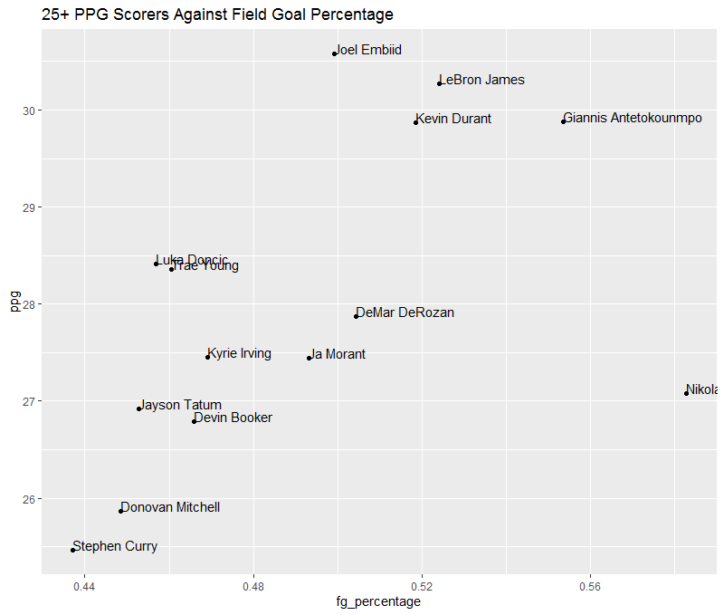

## Motivations of Our Data Analysis:
What motivates our analysis is a desire to examine the relationship between trends in both the MLB and NBA, and see what comparisons we can draw between the two leagues, especially in regards to player streakiness. We define a streak as the measure of the number of consecutive games a player performs above their average in a specific statistic. We define streakiness as a players propensity to perform above their average, and to what degree over the course of a season. We specifically focus on positive streaks because our goal is to understand player success as opposed to player failure. Additionally, we define pace streakiness as the variation in a player's statistical pace throughout the season. The main variables that we are interested in analyzing are hits, walks, home runs and strikeouts in the MLB, and points, rebounds, and assists in the NBA. To accomplish this goal, we have split the project into two separate tasks. We first performed analysis on both the NBA and MLB data separately to gain insight into how streaks are distributed in their respective leagues on a game-to-game basis. Once this was completed, we combined our findings to determine whether any relationships exist between baseball and basketball players. Finally, we take a step back and look at streakiness on the seasonal level by looking at pace variation to compare the effects of streakiness on overall performance in both leagues.

## NBA EDA:

## Identifying Streaks:

For the NBA data, we first identified the longest streaks in the NBA. This would help us get a sense of which players had the longest streaks for a particular statistic in the league in a given season. The first statistic to look at was points. To assess the longest scoring streaks in the league, we calculated the points per season for each player. The dataset contains game-by-game data for each player, but does not account for entire season statistics. This meant that some cleaning and calculations were necessary. First, as stated in the Data page, any erroneous extra rows were removed. Then the season average in points scored was caclulated by dividing the total points scored by the total number of games played for each player.  The field goal percentage was also calculated by dividing the total number of field goal made by the total number offield goal attempts. As seen in the table below, the table now listed the season points and field goal average, grouped by each player. Similarly, the assists and rebounds per game were also calculated. Additionally, we used some advanced metrics to aid us in our inference and analysis. In particular, we use true shooting percentage, offensive rating, and  usage rate. TS% is a weighted field goal percentage that accounts for the difference in two and three point shots, and adjusts for free throws. Offensive rating is a metric that uses a per 100 posessions basis for offensive capability including TS%, but it also accounts for turnovers. Usage percentage is a metric of how often the player is used in a team's offense, which is relevant for determining how much player's will score.

```{r nbadata, echo=FALSE}
suppressPackageStartupMessages(library(tidyverse))
suppressPackageStartupMessages(library(knitr))

nba_data22 <- read.csv(file = '../dataset/ASA All NBA Raw Data 2022 regular season.csv')

nba_ppg22 <- group_by(nba_data22, player) %>%
  filter(mp != '0:00') %>%
  distinct(game_date, .keep_all = TRUE) %>%
  summarize(total_games = n(),
            ppg = sum(pts)/total_games,
            fg_percentage = sum(fg)/sum(fga),
            apg = sum(ast)/total_games,
            rpg = sum(trb)/total_games)

head10 <- nba_ppg22 %>% head(10)

knitr::kable(head10)

```

We will take a look below at the most efficient top scorers. Temporarily setting a threshold for players who scored at least 20 points per game, we made a scatterplot that visualized this relationship to get a sense of who we might expect to have the longest streaks, seen below. 


```{r eval=FALSE, echo=FALSE}

scoring <- filter(nba_ppg22, ppg >= 25)

ggplot(scoring, aes(x=fg_percentage, y=ppg, label=player)) +
  geom_point() +
  geom_text(hjust=0, vjust=0) + 
  labs(title="25+ PPG Scorers Against Field Goal Percentage", x="Feild Goal %", y="Points Per Game")


```
``` {r 25pt_vs_fg, echo=FALSE}
# To Prevent Needing to Rerun EDA Each Time

```

We see above that Lebron James and Joel Embiid scored the most points in the 2022 season, and that they were among the most efficient players in this pool alongside Giannis Antetokounmpo, Nikola Jokic, and Kevin Durant. Because of their prolific and efficient scoring, we at first expected them to be the among the players with the longest streaks. However, after further investigation, we determined that these players were fairly consistent and instead hypothesized that the streakiest players (and therefore the players with the longest streaks) would be those with a lower usage rates and lower scoring - possibly role players who were infrequently given a chances to score above their usual means. 

Because we score streaks based on the individual game performance AGAINST their season average, we needed to join the calculated season averages to the entire game-by-game data, as shown below. Additionally, in this merged dataset, we calculated the deviation per game for each of the three following statistics: points, assists, and rebounds. The deviation was calculated as the statistic from one game substracted by that player's season average in that statistic. For example, 5 `pts` scored in one game substracted from 10 `ppg` will result in a `deviationppg` of -5. 

```{r nba merge}

merged2022 <- nba_ppg22 %>% inner_join(nba_data22, by="player") %>%
  filter(mp != '0:00') %>%
  group_by(player) %>%
  distinct(game_date, .keep_all = TRUE) %>%
  ungroup() %>%
  mutate(date = as.Date(game_date, format = "%Y-%m-%d")) %>%
  mutate(deviationppg = pts-ppg,
         deviationapg = ast-apg,
         deviationrpg = trb-rpg) %>%
  arrange(player, date)


```

The next step was to actually find the streaks. For this, we downloaded the package `data.table`. This assisted us in finding the longest consecutive strings of consecutive games for each statistic. Using points as an example, if a player had a game with a positive `deviationppg`, the `positive_dev_ppg` will be 1. This column is tracked by the `Consec_ppg` column, which increases by 1 each time a player has a positive deviation in a consecutive game. We accounted for each player, grouping by player within this function to ensure that the streaks don't overlap players by mistake. We also took this opportunity to find the number of games played by a player in the season. This allows us to plot using game number instead of game date for more consistency. 


```{r nba streaks, include=FALSE}

suppressPackageStartupMessages(library(data.table))

streaks2022 <- merged2022

setDT(streaks2022)

streaks2022[, positive_dev_ppg := +(deviationppg > 0)
][positive_dev_ppg == 0]

streaks2022[, positive_dev_apg := +(deviationapg > 0)
][positive_dev_apg == 0]

streaks2022[, positive_dev_rpg := +(deviationrpg > 0)
][positive_dev_rpg == 0]

streaks2022[, Consec_ppg := ifelse(positive_dev_ppg == 1, 1:.N, 0L), by = rleid(positive_dev_ppg == 1, player)]

streaks2022[, Consec_apg := ifelse(positive_dev_apg == 1, 1:.N, 0L), by = rleid(positive_dev_apg == 1, player)]

streaks2022[, Consec_rpg := ifelse(positive_dev_rpg == 1, 1:.N, 0L), by = rleid(positive_dev_rpg == 1, player)]

streaks2022[, game_number := ifelse(positive_dev_ppg == 1 | positive_dev_ppg == 0, 1:.N, 0L), by = rleid(player)]
```

```{r head, echo = FALSE}

streaktable <- streaks2022 %>% 
  select(player, date, ppg, pts, deviationppg, positive_dev_ppg, Consec_ppg, apg, ast, deviationapg, positive_dev_apg, Consec_apg, rpg, trb, deviationrpg, positive_dev_rpg, Consec_rpg, game_number) %>% head(10)

knitr::kable(streaktable)


```

The above table shows the first 10 rows in the `streaks2022` dataset, showing the way the streaks were counted. Using this table, we could now see the players with the longest streaks.

```{r nba ppgstreak, echo=FALSE}

streaktable2 <- streaks2022 %>%
  group_by(player) %>%
  summarize(max_streak = max(Consec_ppg)) %>%
  select(player, max_streak) %>% 
  arrange(-max_streak) %>%
  head(10)

knitr::kable(streaktable2)

```

As previously theorized, we were able to find that the players with the longest streaks were those who were role players. Only one player (DeMar DeRozan) in the top 10 longest streaks scored over 20 points per game. This would agree with the idea that a longer streak would most likely be accomplished by a player with a lower season average, as a player could be given an opportunity, or go on a 'hot streak' to perform above their usual output.

```{r nba 20ppgstreak, echo=FALSE}

streaktable3 <- streaks2022 %>% 
  filter(ppg >= 20) %>%
  group_by(player) %>%
  summarize(max_streak = max(Consec_ppg)) %>%
  select(player, max_streak) %>% 
  arrange(-max_streak) %>% 
  head(10)

knitr::kable(streaktable3)

```

Even among the best players, scoring over 20 points per game, the majority of players in the top 10 were those scoring in the low 20s. This again fortifies the theory that players who score prolifically in a season are usually less likely to go on streaks, as they are much more consistent and deviate much less significantly or less frequently.


# Further analysis of streaks:
Of note, for this further analysis, we will only be considering those players who average greater than 25 minutes a game to get the sample size into a managable state. We further break down these games into only those where the target player played greater than 15 minutes. This is to account for players that might have gotten hurt early in a game, or benched for being in foul trouble, early ejections, unfavorable matchups etc. By allowing them to play at least 15 minutes, we are giving the player the best opportunity to match their season average. This also has the added benefit of mitigating players who normally do not have a significant role on their team, but feature more prominently in the offense because of injuries/trades, as these players would have a relatively low season average due to not playing much, and then consistently beating this mark once they have an opportunity to do so.  This data is also from 2019-2022, so it is possible for a player to continue their streaks into a new season. Additionally, we will not just be examining a player's max streak, but rather the players with the highest median streak length. This is a more informative metric, as any one player can have a big run once in a season, but it is much more indicative of a player's general streakiness if he consistently performs above his averages. We also want to try to account for the fact that some players will score above average only because they get more opportunities to score. We calculate the average usage percentage for a player in a given year, and only include the games where the usage rate falls into this range. This should give us a better sense of the TRUE streakiness of a player in the NBA. Also to note, the data cleaning and statistics are created in a similar but different way from above.

```{r setup, include=FALSE}
knitr::opts_chunk$set(echo = TRUE)
suppressPackageStartupMessages(library(tidyverse))
suppressPackageStartupMessages(library(here))
suppressPackageStartupMessages(library(modelr))
suppressPackageStartupMessages(library(runner))
```

```{r further data analysis loading, echo=FALSE}
load(here::here("dataset", "clean_nba_data.RData"))
data <-data %>% mutate(PRA=pts+trb+ast) %>%mutate(usg_pct=usg_pct/100)
all_data <-data  %>% group_by(player)  %>% filter(mean(minutes) >25,minutes >15) %>% mutate(change_net = pts - mean(pts),pts_direction  = 
sign(change_net),change_net_PRA=PRA-mean(PRA),PRA_direction=sign(change_net_PRA)) %>% distinct(player,game_id,.keep_all = TRUE) %>%mutate(pts_streak=ifelse(pts_direction >0,streak_run(pts_direction),0),PRA_streak=ifelse(PRA_direction >0,streak_run(PRA_direction),0)) %>% mutate(avg_usg=mean(usg_pct),usg_z=mean(usg_pct)/sd(usg_pct)) %>%filter(usg_z <4)  %>% ungroup() %>% mutate(Team_def_rtg=mean(Opponent_Score/Opponent_pace *100), Opponent_def_rtg=mean(Team_Score/Team_pace *100)) 

```

In these graphs we analyze the relationship between streaks defined by just points scored, and a combination of points, rebounds, and assists. The reasoning behind this is that points scored are not the only statistic of value, and many NBA players occupy different roles within an offense that may lead them to play a style of basketball that leads to more rebounds and assists. We theorized that by combining points rebounds and assists, we would represent big men and players whose value does not come from any one area more equitably in the data. Additionally, we are defining a streak as having started once a player performs above their average in 1 game. If the previous game resulted in a below average performance, they will have a "0" game pts streak. As we will see below, most of the time the players score below their average. However, for the sake of limiting the scope of our analysis, we are not interested in determining negative streaks, and will instead focus on instances of positive streaks. 
```{r further EDA, echo=FALSE}
#visualize distribution of positive player points streaks and PRA streaks
ggplot(all_data) +geom_histogram(aes(x=pts_streak),bins=23)+labs(x="Points Streaks", y="Count")
summary(all_data$pts_streak)

#PRA
ggplot(all_data) +geom_histogram(aes(x=PRA_streak),bins=23)+labs(x="PRA Streaks", y="Count")
summary(all_data$PRA_streak)


```
Interestingly, there does not seem to much of a defined difference in the two distributions, and that a players streakiness can be reasonably well measured by one or the other. Next, lets take a closer look at some individual players and see how they are performing in 2022 by both points and P+R+A
```{r player analysis, echo=FALSE}
#view proportion of  maximum continuing streaks for best, middle, and worst players
data22 <-all_data %>% filter(season=='2022')
streak <-data22$pts_streak
indices<-which(diff(sign(diff(streak)))==-2)+1
local_max <-slice(all_data,indices)

all_streaks_2022 <- local_max %>% group_by(player) %>% summarize(max_streak=max(median(pts_streak))) %>% arrange(desc(max_streak))
best_streaks_2022 <- all_streaks_2022 %>%head(5)
bottom_streaks_2022 <- all_streaks_2022 %>% tail(5)


#PRA
streak <-data22$PRA_streak
indices<-which(diff(sign(diff(streak)))==-2)+1
local_max_PRA <-slice(all_data,indices)

all_PRA_streaks_2022 <- local_max_PRA %>% group_by(player) %>% summarize(max_streak=max(median(PRA_streak))) %>% arrange(desc(max_streak))
best_PRA_streaks_2022 <- all_PRA_streaks_2022 %>%head(5)
bottom_PRA_streaks_2022 <- all_PRA_streaks_2022 %>% tail(5)

ggplot(best_streaks_2022) +geom_col(aes(y=max_streak,x=player)) + labs(title='Best Points Streaks', y="Max Streaks")
ggplot(best_PRA_streaks_2022) +geom_col(aes(y=max_streak,x=player)) + labs(title='Best PRA Streaks', y="Max Streaks")


```

Below, we compare two of the NBA's streakiest players, OG Anunoby of the Toronto Raptors and Josh Hart of the Portland Trailblazers to Stephen Curry, one of the leagues best overall players. In the games that Steph managed to play in 2022 due to injury, he actually went on a 2 game above average streak. But he could not consistently score above his average consistently, wheras OG and Josh Hart consistently went on longer runs.

```{r specific player analysis,echo=FALSE}
#spike plot
scoring<-all_data %>% filter(player == 'OG Anunoby',season == '2022') %>%select(change_net,game_date,PRA_streak)
ggplot(scoring, aes(x=as.Date(as.factor(game_date)), y=change_net, group=1)) +
geom_ribbon(aes(ymin=pmin(change_net,0), ymax=0), fill="red", col="red", alpha=0.5) +
geom_ribbon(aes(ymin=0, ymax=pmax(change_net,0)), fill="green", col="green", alpha=0.5) +
geom_point()+
geom_line(aes(y=0)) + ggtitle('OG Anunoby Deviation From Average (2022)') +
ylab('Points Deviated from Average') +
xlab('Date')
ggplot(scoring,aes(PRA_streak))+stat_ecdf(geom = "step") + labs(title = 'OG Anunoby Streak Length CDF', x='Streak Length', y='CDF')

scoring<-all_data %>% filter(player == 'Josh Hart',season == '2022') %>%select(change_net,game_date,PRA_streak)
ggplot(scoring, aes(x=as.Date(as.factor(game_date)), y=change_net, group=1)) +
geom_ribbon(aes(ymin=pmin(change_net,0), ymax=0), fill="red", col="red", alpha=0.5) +
geom_ribbon(aes(ymin=0, ymax=pmax(change_net,0)), fill="green", col="green", alpha=0.5) +
geom_point()+
geom_line(aes(y=0)) + ggtitle('Josh Hart Deviation From Average (2022)') +
ylab('Points Deviated from Average') +
xlab('Date')
ggplot(scoring,aes(PRA_streak))+stat_ecdf(geom = "step") + labs(title = 'Josh Hart Streak Length CDF', x='Streak Length', y='CDF')


scoring<-all_data %>% filter(player == 'Stephen Curry',season=='2022') %>%select(change_net,game_date,PRA_streak)
ggplot(scoring, aes(x=as.Date(as.factor(game_date)), y=change_net, group=1)) +
geom_ribbon(aes(ymin=pmin(change_net,0), ymax=0), fill="red", col="red", alpha=0.5) +
geom_ribbon(aes(ymin=0, ymax=pmax(change_net,0)), fill="green", col="green", alpha=0.5) +
geom_point()+
geom_line(aes(y=0)) + ggtitle('Stephen Curry Deviation From Average (2022)') +
ylab('Points Deviated from Average') +
xlab('Date')
ggplot(scoring,aes(PRA_streak))+stat_ecdf(geom = "step") + labs(title = 'Stephen Curry Streak Length CDF', x='Streak Length', y='CDF')


```


# Modeling and inference:
To include a more formal statistical inference, we created two separate models to try to understand the probability that a team/player will perform above average, and which factors weigh most heavily in this decision. The first model is a logistic regression model trained on player data that gives us the probability that a player will perform above their average. We identified key variables most relevant to our question as our explanatory variables, and include one interaction term. The formula is as follows: glm(formula=factor(pts_direction)~ts_pct+usg_pct+usg_pct:ts_pct,family=binomial()). Ultimately, we are less interested in the predictive capability of this model, and instead more interested by how it allows us to see changes in probability as the explanatory variables change. Due to the massive number of variables present in the NBA data, we did not perform any model selection for the NBA model, but we handpicked variables that we believed to be the most relevant. Below, we can see that even after accounting for different usage percentages, one of the biggest individual factor in determining whether or not a player will score above their average in many cases is actually their usage percentage. This is somewhat intuitive, as the opportunity to score is a key step to scoring above average. This is further validated by some of the top performers, such as Josh Hart and OG Anunoby, who consistently scored above their average once they were given more offensive responsibilities.As a result of this finding, we will look into more ways to quantify a player's streakiness

```{r nba model 1, echo=FALSE}
#model building by player
mod1 <-all_data %>%ungroup() %>% glm(formula=factor(pts_direction)~ts_pct+usg_pct+usg_pct:ts_pct,family=binomial())
summary(mod1)
mean(mod1$residuals^2)

all_data <-all_data %>%mutate(pts_direction=ifelse(pts_direction==-1,0,1))

grid <- data_grid(ungroup(all_data), ts_pct= seq_range(ts_pct,100),usg_pct= seq_range(usg_pct,5)) %>% add_predictions(mod1, type = "response" )

ggplot(all_data) +geom_line(aes(x=ts_pct,y=pred,color = factor(usg_pct)),data=grid) + labs(x="True Shooting %", y="Probability", title="Probability of Above Average Points", color="Usage Percentage")
```

## MLB Broad Analysis

To generalize the concept of “streakiness” in MLB, we wanted to find out if there was one single stat that could most strongly predict whether a batter is streaky or not.

<br>

```{r echo=FALSE, results='hide'}
library(tidyverse)
library(modelr)
library(ggrepel)

stat_fct <- function(x,y){
  ifelse(y > 0, x/y, 0)
}

bat_data_21 <- read_csv("../dataset/MLB_bat_data_2021.csv") %>%
  filter(pa > 0) %>%
  select(-game_id, -player_id, -details, -batting_order, -DKP, -FDP, -SDP) %>%
  mutate(singles = h - (doubles + triples + home_runs),
         tb = singles + 2*doubles + 3*triples + 4*home_runs,
         on_base = h + bb + hit_by_pitch) %>%
  arrange(player, game_date)

ops_data_21 <- bat_data_21 %>% group_by(player) %>%
  summarize(ab = sum(ab),
            pa = sum(pa),
            tb = sum(tb),
            on_base = sum(on_base)) %>% 
  mutate(obp = stat_fct(on_base, pa), slg = stat_fct(tb, ab),
         ops = obp + slg) %>% select(player, obp, slg, ops)

MLB_avg_21 <- bat_data_21 %>%
  summarize(ab = sum(ab),
            pa = sum(pa),
            tb = sum(tb),
            on_base = sum(on_base)) %>% 
  mutate(obp = stat_fct(on_base, pa), slg = stat_fct(tb, ab),
         ops = obp + slg) %>% select(obp, slg, ops)

bat_data_day_21 <- left_join(bat_data_21, ops_data_21, by = "player") %>%
  mutate(MLB_diff = MLB_avg_21$ops - ops)

sim_21 <- bat_data_day_21 %>% group_by(player) %>% filter(sum(pa) >= 500) %>%
  group_by(game_date) %>%
  mutate(obp_game = stat_fct(on_base, pa),
         slg_game = stat_fct(tb, ab),
         ops_game = obp_game + slg_game,
         ops_diff = ops_game - MLB_avg_21$ops,
         above = (ops_diff > 0)) %>% ungroup() %>% group_by(player) %>%
  summarize(games_above = sum(above), games = n(), per = games_above/games,
            ops = mean(ops), pa = sum(pa), home_runs = sum(home_runs),
            bb = sum(bb), so = sum(so))

model_21 <- lm(per ~ ops, data = sim_21)
beta <- coef(model_21)

s_res_21 <- rstandard(model_21)

log_sim_21 <- sim_21 %>% cbind(s_res_21) %>%
  mutate(streaky = ifelse(s_res_21 < 0, 1, 0))
```

<br>

The primary stat that we used  to determine a player’s value in this analysis is OPS since it is generally considered among statisticians and managers as one of the better metrics of a player's worth. We  calculated among all qualifying players (at least 502 plate appearances) the percentage of their games where they recorded an OPS above the league average of 0.726 and plotted it against their total OPS for the season. Intuitively, we would expect players with higher overall OPS to have a higher percentage of games where they performed above league average, and that’s what we see here:

<br>

```{r echo=FALSE}
model_21 <- lm(per ~ ops, data = sim_21)
beta <- coef(model_21)
summary(model_21)
ggplot(sim_21, aes(ops, per)) + geom_point() +
  geom_abline(intercept = beta[1], slope = beta[2], color = "red") +
  labs(x = "OPS", y = "% of Games Above League Average")
```

<br>

Fitting a linear regression to this data, we find a statistically significant correlation. For our step, we standardized the residuals and determined that players with high magnitude positive residuals were the most “consistent,” and ones with high magnitude negative residuals were the most “streaky.” Why is this? We would expect more streaky players to have a small number of games with big production and a large number of below average games.

<br>

To visualize this decision, here’s a game log of Jose Altuve, who is the most consistent player by our residual measure. The graph represents games where performed above or below his OWN average OPS, and the red line represents the MLB average:

<br>

```{r echo=FALSE}
bat_data_day_21 %>% filter(player == "Jose Altuve") %>%
  group_by(game_date) %>%
  mutate(obp_game = stat_fct(on_base, pa),
         slg_game = stat_fct(tb, ab),
         ops_game = obp_game + slg_game,
         ops_diff = ops_game - ops,
         sign = sign(ops_diff)) %>%
  ggplot() +
  geom_col(aes(game_date, ops_diff, fill = sign), position = "identity",
           show.legend = FALSE) +
  geom_line(aes(game_date, mean(MLB_diff)), color = "red") +
  labs(title = "Jose Altuve Game by Game OPS Data",
       x = "Date", y = "Game OPS compared to average")
```

<br>

And here’s a game of log of Nathaniel Lowe, who is the most streaky player:

<br>

```{r echo=FALSE}
bat_data_day_21 %>% filter(player == "Nathaniel Lowe") %>%
  group_by(game_date) %>%
  mutate(obp_game = stat_fct(on_base, pa),
         slg_game = stat_fct(tb, ab),
         ops_game = obp_game + slg_game,
         ops_diff = ops_game - ops,
         sign = sign(ops_diff)) %>%
  ggplot() +
  geom_col(aes(game_date, ops_diff, fill = sign), position = "identity",
           show.legend = FALSE) +
  geom_line(aes(game_date, mean(MLB_diff)), color = "red") +
  labs(title = "Nathaniel Lowe Game by Game OPS Data",
       x = "Date", y = "Game OPS compared to average")
```

<br>

Now we turned to analyze if there was a single stat that could most accurately predict whether a player was streaky or not. At first, we thought that walks would be the best stat, because of the idea that some players are “free swingers;” players that swing at a ton of pitches, don’t draw many walks, but are still on the roster because of their ability to get hot at certain times. However, walks ended up not being a great predictor. We also tried home runs, but that wasn’t a great predictor either.

<br>

Out of all stats we tried, strikeouts was the best predictor as seen by this linear regression:

<br>

```{r echo=FALSE}
lm_so <- lm(s_res_21 ~ so, data = log_sim_21)
bt_so <- coef(lm_so)
summary(lm_so)
ggplot(log_sim_21, aes(so, s_res_21)) + geom_point() +
  geom_abline(intercept = bt_so[1], slope = bt_so[2], color = "red") +
  labs(x = "Strikeouts", y = "Streakiness (Residual)")
```

<br>

As well as this logistic regression, where we labeled players as streaky or consistent by the SIGN of their residuals:

<br>

```{r echo=FALSE}
log_model_so <- glm(streaky ~ so, data = log_sim_21, family = binomial)
beta_so <- coef(log_model_so)
grid_so <- log_sim_21 %>% data_grid(so) %>%
    add_predictions(log_model_so, type = "response")
summary(log_model_so)
ggplot(log_sim_21, aes(so)) + geom_point(aes(y = streaky)) +
  geom_line(aes(y = pred), data = grid_so, color = "red", size = 1) +
  labs(x = "Strikeouts", y = "Streakiness (Binomial)")
```

<br>

So we conclude that “free swingers” are not necessarily the streaky players, but rather the “swing for the fences” type of players, meaning players that swing as hard as they can as much as they can in order to hit more home runs, but at the cost of striking out more. It is also interesting to note how strikeouts were correlated to streakiness in a statistically significant way but not home runs, meaning the act of “swinging for the fences” relates to streakiness whether or not the players are actually successful in hitting more home runs.

<br>

So how does this type of analysis work on NBA data? For this cross-sport analysis, we filtered through NBA players who played at least 2000 minutes in the 2021-22 NBA season. Our stat of choice for our first linear regression was Average Plus-Minus, which is a stat that measures how much a player’s team outscores their opponent per game when they’re on the floor. Of our sample of players, the mean Plus-Minus was around +2. Like our OPS plot, we plotted a player’s Average Plus-Minus against their percentage of games above +2:


##Further NBA analysis
For the sake of consistency, we also attempted to apply the same analysis to the MLB data to the NBA despite some of the inherent differences in the two leagues. First, we load the data in and create our streaks in the same way as the NBA. 
<br>

```{r echo=FALSE}
load(here::here("dataset", "clean_nba_data.RData"))

NBA_data <- data %>% filter(did_not_play == 0, is_inactive == 0,
                            season == 2022) %>% select(-c(3:21))

ppg_data <- NBA_data %>% group_by(player) %>%
  summarize(ppg = sum(pts)/n(), epm = sum(plus_minus)/n(),
            minutes_tot = sum(minutes)) %>% 
  arrange(desc(ppg))

NBA_avg <- ppg_data %>% group_by(player) %>% filter(minutes_tot >= 2000) %>%
  ungroup() %>% summarize(avg_ppg = mean(ppg), med_ppg = median(ppg),
                          avg_epm = mean(epm))

NBA_data_day <- left_join(NBA_data, ppg_data, by = "player") %>%
  mutate(NBA_diff = NBA_avg$avg_epm - epm)

sim <- NBA_data_day %>% group_by(player) %>% filter(minutes_tot >= 2000) %>%
  group_by(game_date) %>%
  mutate(epm_diff = plus_minus - NBA_avg$avg_epm, above = (epm_diff > 0)) %>%
  ungroup() %>% group_by(player) %>%
  summarize(games_above = sum(above), games = n(), per = games_above/games,
            epm = mean(epm), up = mean(usg_pct), fga = mean(fga), fta = mean(fta))

model <- lm(per ~ epm, data = sim)
beta_NBA <- coef(model)

s_res <- rstandard(model)

log_sim <- sim %>% cbind(s_res) %>%
  mutate(streaky = ifelse(s_res < 0, 1, 0))

summary(model)
ggplot(sim, aes(epm, per)) + geom_point() +
  geom_abline(intercept = beta_NBA[1], slope = beta_NBA[2], color = "red") +
  labs(x = "Average Plus Minus", y = "% of Games with 2+ Plus Minus")
```

<br>

Also like our MLB analysis, we labeled players as either “streaky” or “consistent” based on their standardized residuals of the previous model. However, unlike our MLB analysis, we could not find many stats that could produce statistically significant results for predicting a player’s streakiness. The best one we could find was Usage Pct, which is a stat that measures how often a player handles the ball when his team is on offense.

<br>

Here are the plots for our linear regression:

<br>

```{r echo=FALSE}
lm <- lm(s_res ~ up, data = log_sim)
bt <- coef(lm)
summary(lm)
ggplot(log_sim, aes(up, s_res)) + geom_point() +
  geom_abline(intercept = bt[1], slope = bt[2], color = "red") +
  labs(x = "Usage Rate", y = "Streakiness (Residual)")
```

<br>

And logistic regression:

<br>

```{r echo=FALSE}
log_model <- glm(streaky ~ up, data = log_sim, family = binomial)
beta <- coef(log_model)
grid <- log_sim %>% data_grid(up) %>%
    add_predictions(log_model, type = "response")
summary(log_model)
ggplot(log_sim, aes(up)) + geom_point(aes(y = streaky)) +
  geom_line(aes(y = pred), data = grid, color = "red", size = 1) +
  labs(x = "Usage Rate", y = "Streakiness (Binomial)")
```

<br>

Intuitively, we can reason that players with the ball in their hands more often have more opportunities to affect the game in some way, meaning they are more likely to balance out their positives and negatives on the court, creating more consistent play on a game to game basis. However, it is still not a statistically significant predictor of streakiness.

<br>

There are some limitations to this analysis. For one, baseball and basketball are different in a sense that there are more opportunities for players to contribute in a basketball game than a baseball game. Top NBA players take around 15-20 field goals and 5-10 free throws a game, whereas the top MLB players get around 4-5 plate appearances a game. Therefore, this type of analysis is better suited for baseball, because a player’s production in a single game can vary drastically from their season average more so than in basketball. In addition, it generalizes streakiness as a concept to a great degree, and does not cover game-to-game streaks.

<br>

We also performed a different analysis of streaks in MLB to cover for these shortcomings, and used that analysis to tie in similarities to our NBA analysis.

<br>

## Further MLB analysis
For the sake of consistency, we also attempted to apply the same analysis to the MLB data to the NBA.Luckily, an MLB season is almost twice as long as an NBA season, so similar comparisons can be drawn. 

```{r data loading,include=FALSE}
load(here::here("dataset", "MLB_bat_data_2021.RData"))
problems()

```
As we see below, the MLB has a very similar distribution of hits to points and points +rebounds+assists. Many of its  top players interestingly seem to go on longer streaks more often than their NBA counterparts. 

```{r Final player EDA, echo=FALSE}
#get all of our data by players who meet criteria and calculate streaks
all_data_mlb <-MLB_bat_data_2021 %>% group_by(player)  %>% mutate(change_net = h - mean(h),h_direction  = sign(change_net)) %>% distinct(player,game_id,.keep_all = TRUE) %>%mutate(h_streak=ifelse(h_direction >0,streak_run(h_direction),0)) %>%mutate(ba=sum(h)/sum(pa)) %>% ungroup()

#visualize distribution of positive player hit streaks
ggplot(all_data_mlb) +geom_histogram(aes(x=h_streak),bins=19)  + labs(title='Distribution of max streaks in MLB', x="Hit Streak", y="Count") 
summary(all_data_mlb$h_streak)

#view proportion of  maximum continuing streaks for best, middle, and worst players
streak <-all_data_mlb$h_streak
indices<-which(diff(sign(diff(streak)))==-2)+1
local_max <-slice(all_data_mlb,indices)

all_streaks_2022 <- local_max %>% group_by(player) %>% summarize(max_streak=max(median(h_streak))) %>% arrange(desc(max_streak))
best_streaks_mlb_2022 <- all_streaks_2022 %>%head(5)
bottom_streaks_2022 <- all_streaks_2022 %>% tail(5)

ggplot(best_streaks_mlb_2022) +geom_col(aes(y=max_streak,x=player))+ labs(title='Players With Median Best Streaks in MLB', y="Max Streak") 
```


Below, we look at the top performers in the MLB. As we saw above, Austin Hays and Yoan Moncada are the top performers in the MLB, with pitcher Yu Darvish giving us the lowest streakiness, most likely due to his low number of plate appearances. 
```{r contuining MLB player analysis 2}
scoring<-all_data_mlb %>% filter(player == 'Austin Hays') %>%select(change_net,game_date,h_streak)
ggplot(scoring, aes(x=as.Date(as.factor(game_date)), y=change_net, group=1)) +
geom_ribbon(aes(ymin=pmin(change_net,0), ymax=0), fill="red", col="red", alpha=0.5) +
geom_ribbon(aes(ymin=0, ymax=pmax(change_net,0)), fill="green", col="green", alpha=0.5) +
geom_point()+
geom_line(aes(y=0)) + ggtitle('Austin Hays Hits Deviated from Average') +
ylab('Hits Deviated from Average') +
xlab('Date')
ggplot(scoring,aes(h_streak))+stat_ecdf(geom = "step")+ labs(title='Austin Hays Hits Streak CDF', x="Hits Streak", y="CDF") 

scoring<-all_data_mlb %>% filter(player == 'Yoan Moncada') %>%select(change_net,game_date,h_streak)
ggplot(scoring, aes(x=as.Date(as.factor(game_date)), y=change_net, group=1)) +
geom_ribbon(aes(ymin=pmin(change_net,0), ymax=0), fill="red", col="red", alpha=0.5) +
geom_ribbon(aes(ymin=0, ymax=pmax(change_net,0)), fill="green", col="green", alpha=0.5) +
geom_point()+
geom_line(aes(y=0)) + ggtitle('Yoan Moncada Hits Deviated from Average') +
ylab('Hitss Deviated from Average') +
xlab('Date')
ggplot(scoring,aes(h_streak))+stat_ecdf(geom = "step") + labs(title='Yoan Moncada Hits Streak CDF', x="Hits Streak", y="CDF")  

scoring<-all_data_mlb %>% filter(player == 'Yu Darvish') %>%select(change_net,game_date,h_streak)
ggplot(scoring, aes(x=as.Date(as.factor(game_date)), y=change_net, group=1)) +
geom_ribbon(aes(ymin=pmin(change_net,0), ymax=0), fill="red", col="red", alpha=0.5) +
geom_ribbon(aes(ymin=0, ymax=pmax(change_net,0)), fill="green", col="green", alpha=0.5) +
geom_point()+
geom_line(aes(y=0)) + ggtitle('Yu Darvish Hits Deviated from Average') +ylab('Hits Deviated from Average') +
xlab('Date')

```


## Similarities between the NBA and MLB

Finally, let's look at the comparisons in aggregate data in the NBA and MLB by points, PRA, and hits more in depth. There is a very similar trend among each league, and the distributions match very closely. This may point to the presence of a more universal trait regarding athletes ability to perform above average across long periods of time, not limited to any one league. 

```{r comparison 1, echo=FALSE}
ggplot(all_data_mlb) +geom_histogram(aes(x=h_streak),bins=23) + labs(title='Distribution of hits streaks', x="Hits Streaks", y="Count")
ggplot(all_data) +geom_histogram(aes(x=pts_streak),bins=23) + labs(title='Distribution of points streaks', x="Points Streaks", y="Count")

summary(all_data$pts_streak)
summary(all_data_mlb$h_streak)
```

Next, lets look at the top performers in the MLB and the NBA. Austin Hays had the highest median streak length in the MLB, and Josh Hart had the second highest in the same category in the NBA.  Below, we see the top 5 performers in each league, along with the distribution of streaks and the top players spike plot. As we can see, the top players in the MLB go on longer streaks more frequently than in the NBA. 
```{r comparison 2, echo=FALSE}

scoring<-all_data_mlb %>% filter(player =='Austin Hays') %>%select(change_net,game_date,h_streak)
ggplot(scoring, aes(x=as.Date(as.factor(game_date)), y=change_net, group=1)) +
geom_ribbon(aes(ymin=pmin(change_net,0), ymax=0), fill="red", col="red", alpha=0.5) +
geom_ribbon(aes(ymin=0, ymax=pmax(change_net,0)), fill="green", col="green", alpha=0.5) +
geom_point()+
geom_line(aes(y=0)) + ggtitle('AH Change') +
ylab('Points Deviated from Average') +
xlab('Date')
scoring <-all_data_mlb %>% filter(player %in% best_streaks_mlb_2022$player) %>%select(change_net,game_date,h_streak)
ggplot(scoring,aes(h_streak))+geom_histogram(bins=15)

scoring<-all_data %>% filter(player == 'Josh Hart') %>%select(change_net,game_date,PRA_streak)
ggplot(scoring, aes(x=as.Date(as.factor(game_date)), y=change_net, group=1)) +
geom_ribbon(aes(ymin=pmin(change_net,0), ymax=0), fill="red", col="red", alpha=0.5) +
geom_ribbon(aes(ymin=0, ymax=pmax(change_net,0)), fill="green", col="green", alpha=0.5) +
geom_point()+
geom_line(aes(y=0)) + ggtitle('Josh Hart Change') +
ylab('Points Deviated from Average') +
xlab('Date')
scoring <-all_data %>% filter(player %in% best_streaks_2022$player) %>%select(change_net,game_date,PRA_streak)
ggplot(scoring,aes(PRA_streak))+geom_histogram(bins=15)

```
Again, the results are fairly similar and somewhat surprising. It is interesting to note that some of the top player match each others streakiness quite well. Austin Hays however, completes more sustained runs of games with hits, whereas Josh Hart seems to have gone on only a couple longer runs.
For the final comparison, we will use the models we have trained to see if the predictive capabilities of the models are similar. 
Unfortunately, we can't use quite the same visualizations for the model, since the range of the number of hits is greatly constrained compared to the offensive rating of a player. We see that the NBA model is more accurate in its predictive capabilities for the top players. This is most likely because just the batting average,walks,and  plate appearances are not enough to capture a players hit capabilities.  Another surprising result is in the summary statistics of each model. All model predictors have 3 star significant codes except for true shooting percentage. This seems counter intuitive, as how well a player shoots on a given night should factor very heavily into how much above average they perform. However, in our analysis we thought that a players given offensive production is largely determined by how often they have a chance to shoot AND their shooting percentage, so we included an interaction term between true shooting percentage and usage percentage to factor in this intuition. Ultimately, it still appears that the opportunity to score both in baseball and basketball seems to be the most relevant statistic in this analysis. 

```{r comparison 3 between all players,echo=FALSE}
#model building by NBA player
mod3 <-all_data %>% filter(season=='2022') %>%ungroup() %>% glm(formula=factor(pts_direction)~ts_pct+usg_pct+usg_pct:ts_pct,family=binomial())

summary(mod3)
mean(mod3$residuals^2)


#model building by MLB player
mod4 <-all_data_mlb %>% ungroup() %>% glm(formula=factor(h_direction)~pa+ba+bb+so,family=binomial())
summary(mod4)
mean(mod4$residuals^2)

```

## Flaws/Limitations:

One of the main flaws in this analysis are the innate differences of basketball and baseball in both offensive and defensive aspects of the game. Baseball, especially when on offense, is a more individualistic game, whereas basketball relies heavily on the entire team. When a player is batting, their only objective is to hit the ball, while a basketball player may have to pass, changing the potential outcome, especially for those players with high usage rate. These innate differences cause difficulty when trying to make a 1:1 assessment between the two leagues.  

# Modeling flaws/limitations:
Initially, we had created an xgboost model to predict whether a player would score above their average. However, this type of model does not offer much interpretability so we went with  a logistic regression model. Additionally, we are assuming that streakiness can be explained purely by the stats we have been given. In reality, these are humans with their own personal motivations, weaknesses, sick days, etc. For example, we know certain great players such as Kobe Bryant and Michael Jordan have performed some of their greatest statistical feats due to grudges, sense of pride, and feeling insulted by other players who doubted their ability. Other players, such as Isaiah Thomas of the celtics, dedicated his most statistically positive season to his sister who had tragically passed away. It is difficult to capture these in person motivations, and they have not been accounted for. Another initial inherent limitation is that we are not taking into account some factors that could have an impact on player performance within their team. For example, one of the highest performers in the NBA in our analysis is Josh Hart. What we fail to take into account is that Josh Hart was traded from the New Orleans Pelicans to the Portland Trailblazers in the middle of the 2022 season. His role changed from that of a bench player, to a main scorer and contributor for his team. OG Anunoby, another high performer, saw his role on the Raptors increase drastically as the team began looking to him for more offensive production as his role changed from a developing rookie to a core part of a mature NBA offense. Because we define a streak as performing above their average over their whole career, players such as this may not have their innate "streakiness" accurately measured. This is further outlined by how much usage percentage factors into a players probability of scoring above average. Simply getting more opportunities to score will obviously affect a players offensive output. While we try to mitigate injuries and limit our analysis only to players to are scoring within their average usage percentage range, there may still be outliars. The true sense of players "streakiness" may not be captured by our statistical methods. 

# Pace Modeling
  Though streaks are generally thought of as consecutive successes, we can also model a player's streakiness by his variation is pace throughout the season. This approach allows us to broaden our analysis from the game-to-game perspective analyzed above to the overall season. We can then compare this value to the player's total output to determine to what extent streakiness plays into final season numbers. To do so, we first modeled each player's cumulative stats throughout the season as a piece-wise linear function using the `segmented` library, where the slope of each segment represents the pace of the player during that set of games. For example, Salvador Perez's walks during the 2021 season can be neatly separated into 7 groups of games with different paces. 


  This analysis was performed for every qualifying MLB player's (>=502 plate appearances) cumulative hits, walks, strike outs, and home runs as well as every qualifying NBA player's (>=58 games and >= 15 minutes per game) cumulative points, assists, and rebounds. To perform the analysis, we used the `segmented` function to automatically infer the number and locations of segments. To prevent this function's known limitation of overestimating the number of segments, we made sure to increase the number of iterations and further filter the home runs data to only those players with at least 15 home runs such that the cumulative totals could reasonably be broken down into different paces. The results of the modelling for each individual player can be seen in the shiny application on the Big Picture page. 

  The next step was to measure the variability of paces for each player and stat and combine them. To do so, we defined the pace streakiness as the standard deviation of the player's paces for the given stat weighted by the length (in games) that the player performed at each pace. Intuitively, this means that a player is more streaky the more he changes pace and the shorter he holds each pace for. This measure allows us to compare different players along the same stat throughout the entire season. For example, Salvador Perez's walk streakiness would be 0.137 while AL MVP Shohei Ohtani's walk streakiness was 0.376.

  After calculating the pace streakiness for each player and stat, we explored whether pace streakiness was correlated to final totals in each stat (correclation coefficient) and what percent of the final total variance could be described by the pace streakiness of the player (R^2 value).

## MLB
### Home Runs
  The following plot shows the pace streakiness of each player with respect to home runs as compared against his total home runs for the season. Out of the qualifying players, Salvador Perez had the highest streakiness at 0.246 and J.T. Realmuto had the lowest at 0.024. The streakiness and final season values had a weak correlation of 0.382 and a low R^2 value of 0.146. This means that streakiness plays some part in raising the total number of home runs that a player will hit in a season. This makes sense because it takes a lot of power to hit home runs, but it is hard enough to do that a random luck has a little bit of an effect.


### Hits
  The following plot shows the pace streakiness of each player with respect to hits as compared against his total hits for the season. Out of the qualifying players, Miguel Cabrera had the highest streakiness at 0.552 and Salvador Perez had the lowest at 0.105. The streakiness and final season values had an insignificant correlation of -0.113 and an insignificant R^2 value of 0.013. This means that streakiness plays almost no part in raising the total number of hits that a player will hit in a season (and may even lower the number of hits a player gets). This makes sense because a player's ability to get hits is really about his consistency to do so day after day.


### Strike Outs
  The following plot shows the pace streakiness of each player with respect to strike outs as compared against his total strike outs for the season. Out of the qualifying players, Trevor Story had the highest streakiness at 0.48 and Carlos Santana had the lowest at 0.105. The streakiness and final season values had a low correlation of 0.365 and a low R^2 value of 0.134. This means that streakiness plays some part in raising the total number of strike outs that a player will get in a season. 


### Walks
  The following plot shows the pace streakiness of each player with respect to walks as compared against his total walks for the season. Out of the qualifying players, Aaron Judge had the highest streakiness at 0.395 and Michael Taylor had the lowest at 0.021. The streakiness and final season values had a moderate correlation of 0.518 and a moderate R^2 value of 0.2687. This means that streakiness plays a decent part in raising the total number of walks that a player will get in a season. This makes sense because a player's ability to draw a walk is dependent on his focus on a given day to not swing at bad pitches (which can be hot or cold depending on his mentality at a given time).


## NBA
### Points
  The following plot shows the pace streakiness of each player with respect to points as compared against his total points for the season. Out of the qualifying players, RJ Barrett had the highest streakiness at 6.375 and 	
Miles Bridges had the lowest at near zero. The streakiness and final season values had a low correlation of 0.315 and a low R^2 value of 0.099. This means that streakiness plays some part in raising the total number of points that a player will get in a season.


### Assists
  The following plot shows the pace streakiness of each player with respect to assists as compared against his total points for the season. Out of the qualifying players, Davion Mitchell had the highest streakiness at 2.626 and 	
JaMychal Green had the lowest at 0.131. The streakiness and final season values had a high correlation of 0.668 and a high R^2 value of 0.4467. This means that streakiness plays a large part in raising the total number of assists that a player will get in a season. This makes sense because a player's assists are heavilly dependent on interactions with fellow teammates, which can be hot or cold seemingly randomly.


### Rebounds
  The following plot shows the pace streakiness of each player with respect to rebounds as compared against his total points for the season. Out of the qualifying players, Andre Drummond had the highest streakiness at 2.78 and 	
Kyle Anderson had the lowest at 0.138. The streakiness and final season values had a moderate correlation of 0.494 and a moderate R^2 value of 0.244. This means that streakiness plays a decent part in raising the total number of points that a player will get in a season.


## Flaws/Limitations
  The biggest flaw in the segmented model methodology is that there is no perfect way to break up data into linear segments. This is because you can always "increase the fit" by adding more and more line segments. What we attempt to do is find some sort of meaningful balance of accuracy and the number of segments. To do so, we rely on the cost function in the undelying machine learning model  in the `segmented` function to properly penalize having too many line segments. However, the designers of this function do note that it is prone to overestimating the number of segments. Additionally, the slope of each segment is reflects some sort of average pace within the line segment. This means that each "pace" is not really exact and has some variability that is hard to measure. 

