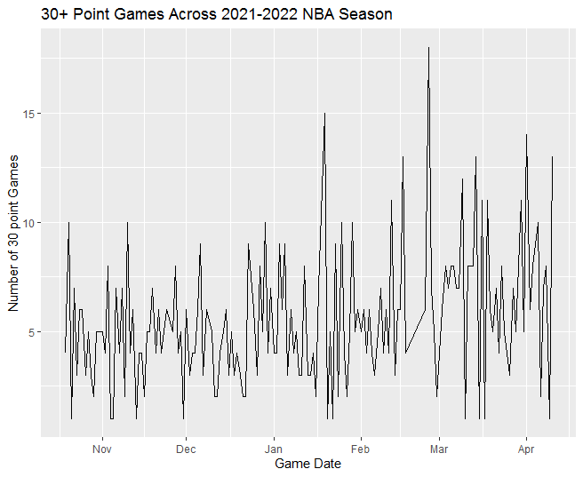

## Cleaning the Data:
To begin the process of cleaning and filtering the data, we'll first want to remove any null values from our analysis. Then, to narrow down the fields in our datasets to those relevant to offensive production and any comparative fields, we'll remove fields that we do not plan to use in our analysis. For our purposes, much of a player's biographical data, like hometown, can be removed, as it won't be used in analysis. Below are some plots created with our datasets to summarize data that will be relevant to our investigation.

## Plots
The plot below filtered the NBA game-by-game dataset to find games that had at least 30 points scored by a player. Then the number of instances of 30 points being scored were plotted against the date of the games. This plot shows the trend of scoring throughout the 2021-2022 NBA season. As can be seen, there were more instances of over 10 players scoring 30+ points in a day in the second half of the season. 

```{r eval=FALSE, include=TRUE}
# Code To Make Graph
library(tidyverse)
library(dplyr)
library(lubridate)

data <- read.csv(file = 'dataset/ASA All NBA Raw Data 2022 regular season.csv')

data30 <- filter(data, pts >= 30) %>%
  select(game_date, pts) %>%
  group_by(game_date) %>%
  summarize(count = n()) %>%
  mutate(date = lubridate::as_date(data30$game_date))

ggplot(data30, aes(x=date, y=count, group = 1)) +
  geom_line() + xlab("Game Date") + 
  ylab("Number of 30 point Games")
```

``` {r 30pt_vs_date}
# To Prevent Needing to Rerun EDA Each Time
library(knitr)


```


The next plot filtered the NBA game-by-game dataset to find players who averaged at least 25 points per game in the 2022 season, and plotted these players against their season field goal percentage. This showed players who exceeded the average scoring of the league, being among the elite scorers and then showed their efficiency. This plot enables us to see the most efficient scorers among the league's top scorers. To make this plot, the data had to be cleaned by removing duplicate rows in the dataset, and removing games that were listed but the players did not play in. Leaving those values in would have skewed the PPG for the season as it would have added extra games. 


```{r eval=FALSE, include=TRUE}
# Code To Make Graph
data <- read.csv(file = 'dataset/ASA All NBA Raw Data 2022 regular season.csv')
data2 <- group_by(data, player) %>%
  summarize(total_pts = sum(pts),
            total_games = n(),
            ppg = total_pts/total_games,
            total_fg = sum(fg),
            total_fga = sum(fga),
            fg_percentage = total_fg/total_fga) %>%
  select(player, ppg, fg_percentage)

scoring <- filter(data2, ppg >= 25)

ggplot(scoring, aes(x=fg_percentage, y=ppg, label=player)) +
  geom_point() +
  geom_text(hjust=0, vjust=0)
```

``` {r 25pt_vs_fg}
# To Prevent Needing to Rerun EDA Each Time
knitr::include_graphics('./Rplot01.png')

```


The next plot is similar to the last one, but we used the MLB dataset to find players with 500 or more plate appearances who had an OPS of .900 or better in the 2021 season. We plotted these two stats against each other to find which players were able to maintain such a high level of production over a large sample size. To clean this data, we removed rows with missing values in plate appearances, grouped by player, calculated season total stats using the sum function, and manually calculated a few stats using the variables: at-bats, hits, doubles, triples, home runs, walks, hit-by-pitches, and plate appearances.

```{r .900ops_vs_pa}
knitr::include_graphics('./Rplot02.png')

```


