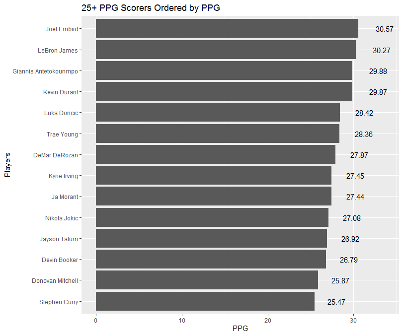

## Confounded Data:
Looking back at Blog 2, we looked at some of the larger picture trends in our data. Regarding the NBA data, one of the things we looked at were the top scorers (particularly those who scored at least 25 points per game), and their field goal percentage. This relationship showed how efficiently the top scorers of the league were, and efficiency is a big factor when considering a player who is experiencing a hot hand. However, the plot from Blog 2 looked at total PPG compared to field goal efficiency, completely disregarding the points earned from free throws. Because of this, we chose to take a deeper look at the PPG these players scored, and subtracting their points earned from free throws.

```{r eval=FALSE, include=TRUE}
# Code To Make Graph
library(tidyverse)

data <- read.csv(file = './ASA All NBA Raw Data 2022 regular season.csv')

data2 <- group_by(data, player) %>%
  filter(mp != '0:00') %>%
  distinct(game_date, .keep_all = TRUE) %>%
  summarize(total_pts = sum(pts),
            total_games = n(),
            ppg = total_pts/total_games,
            total_ft = sum(ft),
            ftpg = total_ft/total_games,
            pts_noft = ppg-ftpg)

scoring <- filter(data2, ppg >= 25)

ggplot(scoring, aes(reorder(player, ppg, sum), ppg, label=format(round(ppg, 2), nsmall = 2))) +
  geom_col() +
  coord_flip() + 
  geom_text(position = position_stack(vjust = 1.1)) +
  ylab('PPG') +
  xlab('Players') +
  ggtitle('25+ PPG Scorers Ordered by PPG')

```

``` {r ppg_withFTs}
# To Prevent Needing to Rerun EDA Each Time
library(knitr)


```

Now, the graph above simply shows the players who scored the most PPG in the 2022 NBA season. At face value, it would be easy to determine that Joel Embiid most likely had the highest points scored from 2pt and 3pt field goals, as he is far ahead many of the other players in overall PPG. However, by calculating the free throws made per game for each player, and then subtracting this from their points per game, we can see the effects that free throws had on their overall scoring.

```{r eval=FALSE, include=TRUE}
# Code To Make Graph
ggplot(scoring, aes(reorder(player, pts_noft, sum), pts_noft, label=format(round(pts_noft, 2), nsmall = 2))) +
  geom_col() +
  coord_flip() + 
  geom_text(position = position_stack(vjust = 1.1)) +
  ylab('PPG without FTs') +
  xlab('Players') +
  ggtitle('25+ PPG Scorers Reordered by PPG Without Freethrows')

```

``` {r ppg_noFTs}
# To Prevent Needing to Rerun EDA Each Time
library(knitr)
knitr::include_graphics('./Rplot_ppg_no_fts.png')

```

As can be seen above, the PPG without free throws drastically changes the landscape of the scoring leader board. Joel Embiid was shockingly had the lowest amount of points scored per game among the same pool of scorers. This discrepancy shows the effect that free throws can have on total scoring. Most people would also say that field goal scoring and efficiency plays a larger role in determining a player's hot streak. Many players (including Joel Embiid) who score heavily relying on free throws are often criticized for foul-baiting and playing an unappealing game. The graph above displays what one may consider a more realistic look at the PPG of the highest scoring players from strictly field goals.


## MLB Data:
We also faced the question of how we can relate Blog 2 and our analysis of streaks to the MLB data. In Blog 2, we plotted the plate appearances of the top hitters of the 2021 season against their OPS. One part of OPS is their on-base percentage (OBP). We wanted to see how often these top players had a single-game OBP above the league average (we manually calculated the MLB average OBP as .316). This graph is of Bryce Harper, who had the highest OPS in MLB in 2021, and how he performed against the league average of the season in terms of OBP.

```{r eval=FALSE, include=TRUE}
library(tidyverse)
library(ggrepel)

stat_fct <- function(x,y){
  ifelse(y > 0, x/y, 0)
}

bat_data <- read_csv("dataset/MLB_bat_data_2021.csv")

bat_data_2 <- bat_data %>% select(-game_id, -player_id, -details,
                                  -batting_order, -DKP, -FDP, -SDP) %>%
  mutate(singles = h - (doubles + triples + home_runs),
         tb = singles + 2*doubles + 3*triples + 4*home_runs,
         on_base = h + bb + hit_by_pitch) %>%
  arrange(player, game_date)

ops_data <- bat_data_2 %>% group_by(player) %>%
  summarize(ab = sum(ab),
            pa = sum(pa),
            tb = sum(tb),
            on_base = sum(on_base)) %>% 
  mutate(obp = stat_fct(on_base, pa), slg = stat_fct(tb, ab),
         ops = obp + slg) %>% select(player, obp, slg, ops)

MLB_avg <- bat_data_2 %>%
  summarize(ab = sum(ab),
            pa = sum(pa),
            tb = sum(tb),
            on_base = sum(on_base)) %>% 
  mutate(obp = stat_fct(on_base, pa), slg = stat_fct(tb, ab),
         ops = obp + slg) %>% select(obp, slg, ops)

bat_data_day <- left_join(bat_data_2, ops_data, by = "player")

bat_data_day %>% filter(player == "Bryce Harper") %>%
  group_by(game_date) %>%
  mutate(obp_game = stat_fct(on_base, pa),
         slg_game = stat_fct(tb, ab),
         ops_game = obp_game + slg_game,
         obp_diff = obp_game - MLB_avg$obp,
         sign = sign(obp_diff)) %>%
  ggplot(aes(game_date, obp_diff)) +
  geom_col(aes(fill = sign), position = "identity", show.legend = FALSE) +
  labs(title = "Bryce Harper Game by Game OBP Data",
       x = "Date", y = "Game OBP compared to MLB average")
```

```{r BHarper_OBP}
library(knitr)
knitr::include_graphics('./BHarper_OBP.png')
```

Obviously, this graph is just one player. In further analysis, we would want to find players who were above league average OPS the most often. In relation to “hot streaks,” an indication of a streaky player would be one who has a high OBP but fewer games above league average than expected, meaning much of their production comes in quick, large bursts.

## Modeling
```{r eval=FALSE, include=TRUE}
bat_data <- MLB_bat_data_2021 %>% 
  group_by(player_id) %>% 
  arrange(game_date) %>% 
  mutate(hr_total = sum(home_runs), hr_cum = cumsum(home_runs), temp =1, games = cumsum(temp)) %>%
  filter(hr_total>47)

(unique(bat_data$player))

mins <- bat_data %>% 
  summarize(min_max_hr = min(hr_cum), min_max_games = min(games))

maxs <- bat_data %>% 
  summarize(min_max_hr = max(hr_cum), min_max_games = max(games))

min_max <- bind_rows(mins,maxs) %>% group_by(player_id)

ggplot(bat_data) + 
  geom_line(aes(x=games, y=hr_cum, color=player_id)) +
  geom_line(data = min_max, mapping = aes(x=min_max_games, y=min_max_hr, color = player_id), alpha =0.5)

data <-  bat_data %>% filter(player_id == "perezsa02")
fit_lm <- lm(hr_cum ~ 1 + games, data = data)
fit_segmented = segmented(fit_lm, seg.Z = ~games, npsi = 6)
my_fitted <- fitted(fit_segmented)
my_model <- data.frame(games = data$games, hr_cum = my_fitted)
ggplot(my_model, aes(x = games, y = hr_cum)) + geom_line() + geom_point(data = data, aes(x=games, y=hr_cum), color="red", alpha =0.1)
```

```{r Segment_Linear_Model}
library(knitr)
knitr::include_graphics('./Segmented_Linear_Model.png')
```
For modelling streaks, we would like to break up a player's cumulative performance into linear segments, where each segment's slope represents the pace of performance at a given point in the season. Players with more varying paces are one that tend to be streakier, while a consistent player will stay on a consistent pace throughout the season. Above is a graph of Salvador Perez's cumulative home runs throughout the 2021 season segmented into 6 different paces. Perez's pace is very nicely segmented into different periods, with a clear accelerated pace in the 2nd half of the season. To do this, we are using the **segmented** library and fit linear segments. The difficulty with this is that there is no "right way" to segment or correct number of segments. The library allows for either fixed number of segments or for the back-end machine learning model to infer the number of segments. While inferring the number of segments is ideal, we will need to play with the ML parameters to ensure that none of the segments are too small (which would not really represent a different pace but instead noise). 