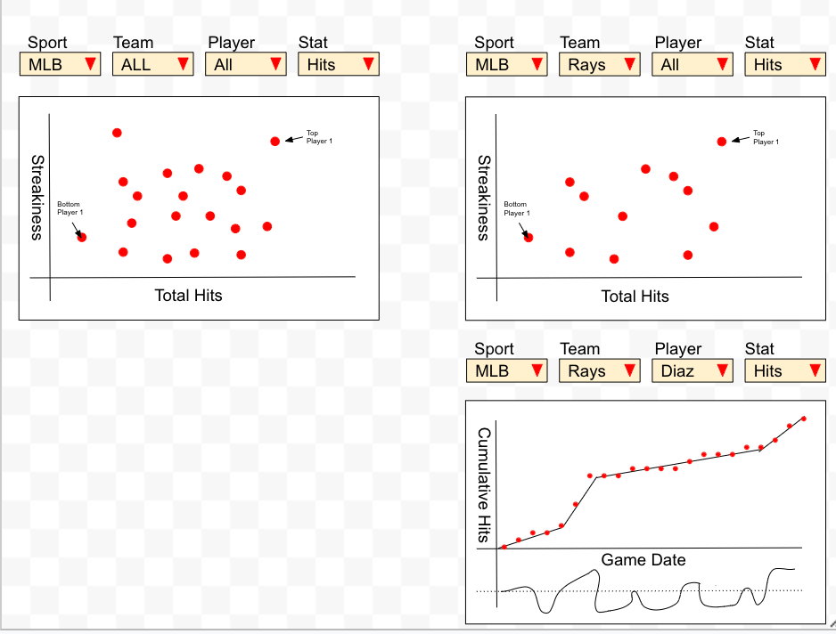

## Interactive Data:


When considering interactive data for our project, due to the nature of our project, we want to be able to give the user multiple options to sift through multiple visualizations. Because we are covering two sports, both with a multitude of players and statistics, we want to give the user the option to choose the sport, team, player, and statistic they would like to see the trend of. Below is an image of what we imagine the interactive may look like. 


``` {r interactive}

library(knitr)


```

As you can see the user has the option to narrow down the interactive to fit their desired query. We would like to look into personalizing the query as well. We could perhaps ask the user who their favorite player from the last few years is, or ask them what their favorite team is so that they can look at that teams streakiness over a given period of time. We may also consider giving users the optino to view the data "globally" - that is, comparing the specific query they searched for against a broader backdrop. For example, if they looked for a player's streak trends, then perhaps comparing them against the rest of that player's team, or if a team was queried for, then comparing that team's streaks to the entire league. The draft we have now allows users to look at a team's streak statistics by selecting "All" players, or "zoom in" by selecting a specific player. Likewise, selecting "All" teams will give an overview of the league's trends for a selected statistic. 


There are a lot of ways to approach an interactive model for sports visualizations, but we think this is an optimal draft for our data. It provides a variety of options and gives the user a concise image of trends ranging from league-wide to player-specific. There are of course some things we can look at in terms of customizing the qury. For example, we could look at season by season data as well, showing how a team or player performed in a given season or across a range of seasons. Perhaps we can even show how the trends have evolved over certain seasons to give a more clear and comparative visual. These are things we will have to consider when exploring the data and the interactive. We may also want to give the user more options to customize and personalize their search beyond favorite team/player, so we will consider a few other potential options on this front.


